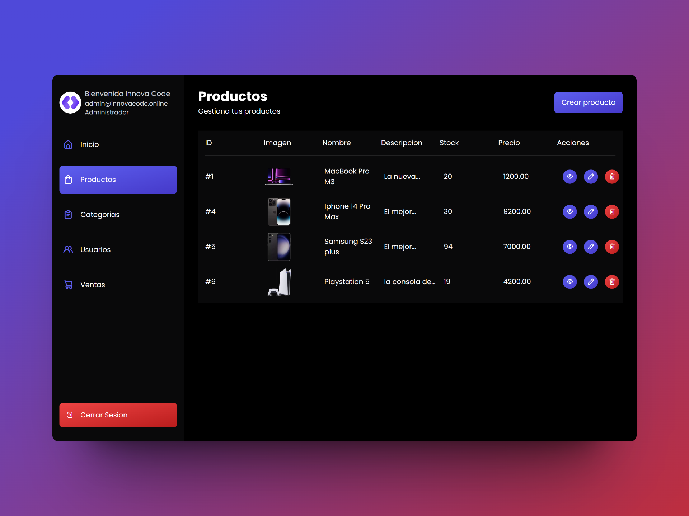

# Control de inventarios - Laravel 10
<p align="center"><a href="./public/proyecto.png" target="_blank"></a></p>

Esta es una guia de instalacion del proyecto "Control de inventarios" para el curso de Laravel 10

<p align="center"><a href="https://laravel.com" target="_blank"></a></p>


## Instalaciones
1. Instalar dependencias del proyecto
```bash
composer install
```

2. Renombrar el archivo ``.env.example`` a ``.env`` (Corregir variables de entorno si es necesario).

3. Crear contenedor de Docker con la base de datos
```bash
docker compose up -d
```

4. Correr migraciones
```bash
php artisan migrate
```

5. Ejecutar el proyecto
```bash
php artisan serve

# en otra terminal

npm run dev
```